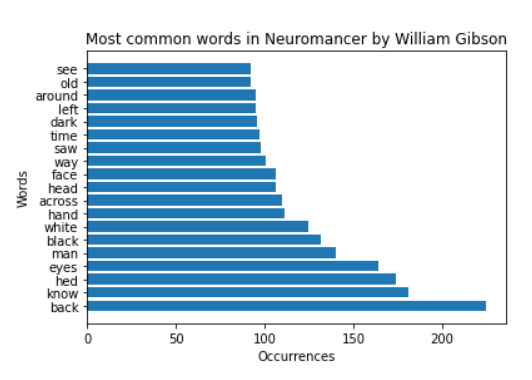

# Final Project for Big Data Course
> by Devin Ingersoll

This project will demonstraight how to use pyspark to perform data processing on a file in order to tell a story using the data

## The data
I am pulling in a txt file of one of my favorite books [Neuromancer](https://archive.org/stream/NeuromancerWilliamGibson/Neuromancer%20-%20William%20Gibson_djvu.txt) by William Gibson from good old [archive.org](archive.org) (probably legal... right?). Becasue pulling this would directly from archive.org would include HTTP tags and such, I copied the text into a txt file within my repo. 

## Tools
- The code was written and tested using [Databricks Community Edition](https://community.cloud.databricks.com) (a free, web-based platform for working with spark in IPython type notebooks)
- To pull the data in and perform actions on it I am using a [Pyspark](https://spark.apache.org/docs/latest/api/python/index.html), a python interface for Apache Spark: an analytics engine for big data processing

### Code
1. First, import the data into python > databricks > spark 
```python
import urllib.request
urllib.request.urlretrieve("https://raw.githubusercontent.com/deviningers/big-data-final/main/neuro.txt" , "/tmp/neuro.txt")
dbutils.fs.mv("file:/tmp/neuro.txt", "dbfs:/data/neuro.txt")
txtRDD = sc.textFile("/data/neuro.txt", 3)  # change 3 to be any number of servers with a dataset copy
```
2. Use flatmap to create a dataset of each word
```python
wordsRDD = txtRDD.flatMap(lambda line : line.lower().strip().split(" "))
```
3. Now filter out symbols, stopwords, and names
```python
# remove symbols with regex
textWordsRDD = wordsRDD.map(lambda w: re.sub(r'[^a-zA-Z]','',w))

# Remove all stopwords using pyspark's stopword remover function
from pyspark.ml.feature import StopWordsRemover
stopwords = StopWordsRemover().getStopWords()
cleanRDD=textWordsRDD.filter(lambda w: w not in stopwords)

# Remove names and connectors
removeWords = ['case', 'molly', 'armitage', 'maelcum', 'riviera', 'finn', 
'said', '', 'like', 'youre', 'something', 'thing' , 'get', 'got', 'dont']
cleanerRDD=cleanRDD.filter(lambda w: w not in removeWords)
```
4. Map out the words into key value pairs so that the data can be further processed
```python
IKVPairsRDD = cleanerRDD.map(lambda word: (word,1))
```
5. Now we can reduce by key to count all the times a word is used 
```python
wordCountRDD = IKVPairsRDD.reduceByKey(lambda acc, value: acc+value)
```
6. You can now collect the data using ```wordCountRDD.collect()``` or continue manipulating the data as we do to export it to a graph

## Results
- We can export the top 20 most common words by sorting the data, cutting it, and transforming the data into a tuple so that we can export it to a graph using matplotlib.pyplot:

- Looking at the data we can see some commonalities such as the words ```head face eyes saw see``` which is probably pretty common in books spend time describing characters more than locations. We can also see a pattern of the term ```black``` being slightly more common than ```white``` and ```dark``` being more much more common than ```light``` which is in the top 50. This shows that the locations and/or situations usually take a darker tone as well as being very monochromatic and ridged. This is just my interpretation of the data though. Feel free to take the code and draw your own conclusions :)!

#### Resources
- [Dr. Case's (Instructor) lesson repo](https://github.com/denisecase/starting-spark)
- [Neuromancer txt](https://archive.org/stream/NeuromancerWilliamGibson/Neuromancer%20-%20William%20Gibson_djvu.txt)
- [Pyspark Documentation](https://spark.apache.org/docs/latest/api/python/index.html)
- [Pyspark examples](https://spark.apache.org/examples.html)
